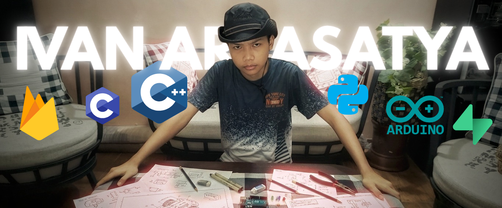

<div align="center">
<p align="center">
  
</p>

[](https://readme-typing-svg.demolab.com)


</div>

---

## 🌟 About Me

I'm a 10th-grade student at SMK Telkom Malang with a strong interest in **IoT, embedded programming, robotics, and software development**. Since I was young, I've enjoyed exploring electronic circuits, writing code, and turning ideas into real, working products.

- 📍 Based in Malang, Indonesia
- 🎯 Focused on real-world hardware + software projects
- 💡 I love building small automation and robotics solutions
- 🌱 Currently learning Python, C++, Arduino, and embedded networking

## 🚀 Project Highlight: Feedo — Smart IoT Pet Feeder

**Feedo** is a project that combines automation, IoT, and convenience for pet care.

- 🐶 Automatic feeding schedule using sensors and a motor
- 🌐 Control & monitoring through a simple web dashboard
- 📡 The device's brain: **ESP8266** with Wi-Fi connectivity
- ⏱️ RTC and safety features to prevent failures
- 🔋 Components: Servo motor, sensor, RTC, Firebase, manual button

> "Bringing technology into everyday life through practical IoT devices."

---

## 🧩 Hobbies & Interests

- 🤖 **Robotics** and small mobile robots
- 🌐 **IoT** for smart homes, pet care, and monitoring
- 🔌 **Embedded Programming** with Arduino / ESP boards
- 💻 **Software Development** for web apps and interfaces
- 🎮 Experimenting with logic and automation through games like Minecraft

---

## 🛠️ Tech Stack & Tools

### Programming Languages


### Hardware & Embedded


### Platforms & Tools


---

## 📦 Toolchain & Workflow

- 🧪 Circuit design and rapid prototyping
- 🧩 Hardware + firmware integration
- 🌐 Simple web dashboard development
- 🛠️ Debugging sensors, serial communication, and connectivity
- 🔁 Project documentation and online portfolio

---

## 📚 Currently Learning & Focusing On

- Embedded networking and MQTT
- IoT security & reliability
- Mobile robotics with motor control
- Web-based interface development
- Home automation and environmental monitoring

---

## 📊 Dynamic GitHub Stats

<div align="center">


</div>

## 📈 Activity Graph

<div align="center">


</div>

## ⏱️ Weekly Coding Activity (WakaTime)

<!--START_SECTION:waka-->
```text
From Aug 4, 2026 - Aug 11, 2026

C++          ████████████░░░░░░░░░░░░   45.2%
Python       ███████░░░░░░░░░░░░░░░░░   28.6%
Arduino      █████░░░░░░░░░░░░░░░░░░░   16.1%
HTML         ██░░░░░░░░░░░░░░░░░░░░░░   10.1%
```
<!--END_SECTION:waka-->

---

## 🎮 Fun Zone: Mini Games & Quote Generator

<div align="center">


<br /><br />


</div>

Want to challenge yourself? Try guessing my next commit streak, or fork this repo and race me on [WakaTime leaderboards](https://wakatime.com/leaders) 😄

---

## 📬 Contact Me

- Portfolio: [https://s.id/ivanarya-portfolio](https://s.id/ivanarya-portfolio)
- GitHub: [github.com/ivanaryasatya](https://github.com/ivanaryasatya)

If you have an idea for an IoT, robotics, or automation project, or just want to talk about embedded programming, let's chat!

<div align="center">


</div>

---